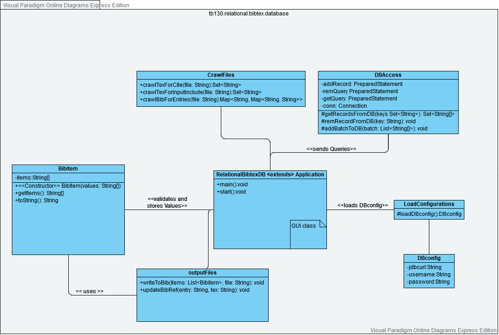

# Overview
The Application was part of my project for the course `Technical Documentation`.

# Requirements  

**Java**: JDK 23 or higher  
**Maven**: 3.9.8 or higher  
**PostgreSQL**: 17.2 or higher  
**Optional: pgAdmin 4**: To manage the Postgre database

## Key Dependencies
The project uses the following libraries:  

- **JavaFX** (17.0.6)  
  - `javafx-controls`  
  - `javafx-fxml`  
  - `javafx-graphics`  
  - `javafx-media`  
  - `javafx-base`  
- **JUnit** (4.13.1): For unit testing.  
- **Log4j** (2.17.1): For logging and application diagnostics.  
- **postgresql** (42.7.2): PostgreSQL Driver.  
- **jackson-databind** (2.13.4.2): To load the PostgreSQL DB credentials.

All dependencies are managed through Maven. For the full list, see the `pom.xml` file.

## Font

`The IBM Plex Sans` Font was used in this project. You can find it here:  
https://github.com/IBM/plex  

Simply download the zip and extract the folder `ibm-plex-sans/fonts/complete` to [src/main/resources/IBM Plex Sans Fonts](src/main/resources/IBM%20Plex%20Sans%20Fonts/)

# Usage

1. Set up your PostgreSQL Database, for example using the provided Configuration in [src/main/resources](src/main/resources)
2. Create a `DBconfig.json`, using the provided [DBconfig_template.json](DBconfig_template.json)
3. Run using your preferred IDE or Maven. Entry is the `Driver.java` file

# BibTeX Items and keys

| Index         | 0   | 1    | 2      | 3      | 4       | 5     | 6         | 7       | 8         | 9    | 10           | 11           | 12          | 13     | 14     | 15     | 16   | 17      | 18      | 19    | 20     | 21    | 22   |
|---------------|-----|------|--------|--------|---------|-------|-----------|---------|-----------|------|--------------|--------------|-------------|--------|--------|--------|------|---------|---------|-------|--------|-------|------|
| Value         | key | type | author | editor | address | title | booktitle | journal | publisher | year | howpublished | organization | institution | school | volume | series | type | edition | chapter | month | number | pages | note |
| Required Keys |     |      |        |        |         |       |           |         |           |      |              |              |             |        |        |        |      |         |         |       |        |       |      |
| ARTICLE       | x   | x    | x      |        |         | x     |           | x       |           | x    |              |              |             |        | o      |        |      |         |         | o     | o      | o     | o    |
| BOOK          | x   | x    | a      | a      | o       | x     |           |         | x         | x    |              |              |             |        | o      | o      |      | o       |         | o     | o      |       | o    |
| BOOKLET       | x   | x    | o      |        | o       | x     |           |         |           | o    | o            |              |             |        |        |        |      |         |         | o     |        |       | o    |
| INBOOK        | x   | x    | a      | a      | o       | x     |           |         | x         | x    |              |              |             |        | o      | o      | o    | o       | b       | o     | o      | b     | o    |
| INPROCEEDING  | x   | x    | x      | o      | o       | x     | x         |         | o         | x    |              | o            |             |        | o      | o      |      |         |         | o     | o      | o     | o    |
| CONFERENCE    | x   | x    | x      | o      | o       | x     | x         |         | o         | x    |              | o            |             |        | o      | o      |      |         |         | o     | o      | o     | o    |
| INCOLLECTION  | x   | x    | x      | o      | o       | x     | x         |         | x         | x    |              |              |             |        | o      | o      | o    | o       | o       | o     | o      | o     | o    |
| MANUAL        | x   | x    | o      |        | o       | x     |           |         |           | o    |              | o            |             |        |        |        |      | o       |         | o     |        |       | o    |
| PHDTHESIS     | x   | x    | x      |        | o       | x     |           |         |           | x    |              |              |             | x      |        |        |      |         |         | o     |        |       | o    |
| MASTERSTHESIS | x   | x    | x      |        | o       | x     |           |         |           | x    |              |              |             | x      |        |        | o    |         |         | o     |        |       | o    |
| MISC          | x   | x    | o      |        |         | o     |           |         |           | o    | o            |              |             |        |        |        |      |         |         | o     |        |       | o    |
| PROCEEDINGS   | x   | x    |        | o      | o       | x     |           |         | o         | x    |              | o            |             |        | o      | o      |      |         |         | o     | o      |       | o    |
| TECHREPORT    | x   | x    | x      |        | o       | x     |           |         |           | x    |              |              | x           |        |        |        | o    |         |         | o     | o      |       | o    |
| UNPUBLISHED   | x   | x    | x      |        |         | x     |           |         |           | o    |              |              |             |        |        |        |      |         |         | o     |        |       | x    |

  
  
a: both or either  
b: both or either

# UML Class Diagram
The following uML Class Diagram describes the core functions of the architecture:  


`Bibitem` is the most important class in the document. Every item has an array containing an entry for each of the 23 bibtex keys. The `getItems()` method returns the array, the `toString()` method overrides the default `toString` function to look like a classic entry in a bibtex file, e.g.:
```BibTeX
@conference{Xconference,   
author = "",
title  = "",
...
}
``` 


# UML Sequence Diagram